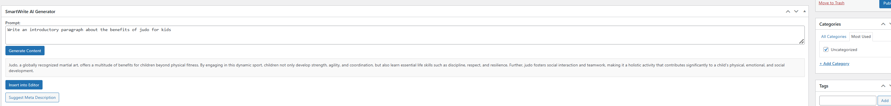
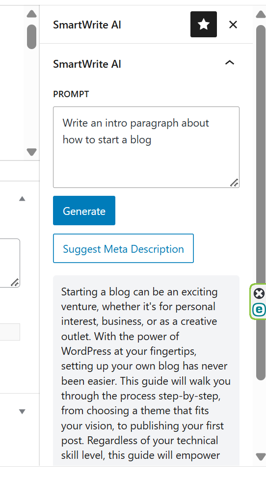
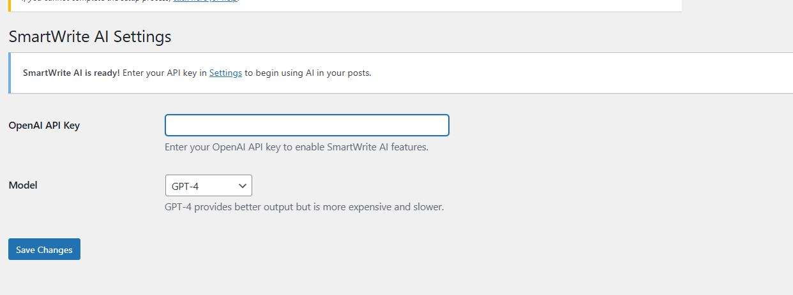

# SmartWrite AI

**An AI-powered writing assistant for WordPress.**  
Generate intros, summaries, meta descriptions, and more — directly inside the Block or Classic Editor using OpenAI's GPT models.

---

## ✨ Features

- ✍️ Generate intros, summaries, and meta descriptions instantly
- 🧠 GPT-powered suggestions with smart prompt handling
- 🧩 Works in both **Block Editor** and **Classic Editor**
- 🔐 Bring your own OpenAI API key (no vendor lock-in)
- ⚙️ Choose between **GPT-3.5** or **GPT-4** in settings
- 💡 Clean interface and fast output with no extra clutter
- ✅ Compatible with most themes and writing workflows

---

## 🚀 SmartWrite Pro (Coming Soon)

Upgrade to unlock:

- 🎯 Tone, length, and detail controls
- 📋 Blog outline and section generation
- 📈 SEO-focused tools and templates
- 🔒 Commercial use license
- ⚡ Priority OpenAI API access

[➡️ Learn more & upgrade](https://pluginavenue.com/checkout/smartwrite-pro)

---

## 📷 Screenshots

### 1. Classic Editor Integration

### 2. Block Editor (Gutenberg) Sidebar

### 3. Settings Page

---

## 🔧 Installation

1. Upload the plugin to `/wp-content/plugins/`
2. Activate it via **Plugins → Installed Plugins**
3. Go to **Settings → SmartWrite AI**
4. Paste your [OpenAI API key](https://platform.openai.com/api-keys)
5. Start generating content!

---

## 📘 FAQ

### Is the plugin free?

Yes! You only need your own OpenAI API key. The plugin doesn't charge you or store your data.

### How much does it cost to use OpenAI?

Usage is metered by OpenAI (not this plugin). Approximate cost for GPT-3.5:

- Intro paragraph: ~$0.01
- Summary: ~$0.02
- Meta description: <$0.01

You can monitor your usage at [https://platform.openai.com/account/usage](https://platform.openai.com/account/usage)

### Does it support GPT-4?

Yes! If your OpenAI account has access to GPT-4, just select it in **Settings → Model**.

---

## 🛠️ Developer Notes

- Cleanly written using modern WordPress hooks
- Fully localized for translation
- Classic editor support and Gutenberg block sidebar UI

---

## 📄 License

Licensed under [GPLv2 or later](https://www.gnu.org/licenses/gpl-2.0.html)

© 2025 [Plugin Avenue](https://pluginavenue.com) · Created by [Stephen Scott Moore](https://pluginavenue.com/about)

---

## 🙌 Contribute

Found a bug or want to contribute? Open an issue or PR here on GitHub. Contributions welcome!
